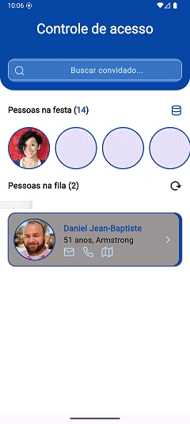

# Access Control
Access Control é um aplicativo desenvolvido em Flutter com Dart, criado para realizar a gestão completa de controle de acesso em eventos, oferecendo fluidez, confiabilidade e uma experiência otimizada para o usuário.

---
### Demonstrações / Screenshots

  
  
   
  

---

### Badges

 

---

### 🚀Tecnologias e Arquitetura

- Framework: Flutter
- Linguagem: Dart
- Arquitetura: MVVM (Model-View-ViewModel)
- Gerenciador de estado: Provider
- Cliente HTTP: Dio
- Banco de dados local: Sqflite
- API integrada: RandomUser API

---

### 🧩 Principais Implementações
- Repository Strategy: organização modular com foco em desacoplamento e extensibilidade.
- Uso de DTOs (Data Transfer Objects): para manipulação e transporte seguro de dados entre camadas.
- Encapsulamento das ViewModels: garantindo segurança e isolamento da lógica de negócio.
- Sistema de tratamento de exceções personalizado: unificando o fluxo de erros e mensagens de retorno.
- Sistema de estilo centralizado: incluindo tipografia, cores e espaçamentos padronizados.
- UI desacoplada da lógica de negócio: seguindo boas práticas de separação de responsabilidades.
- Micro animações: aplicadas em botões, listas e links para aumentar a fluidez e aprimorar a UX.
- Uso de interfaces: reduzindo acoplamento entre camadas e facilitando testes unitários.
- Optimistic State: implementado em operações de busca, inserção e remoção, proporcionando respostas imediatas e reativas na interface.
- Design Pattern Builder: aplicado à criação de componentes de UI reutilizáveis.
- Uso do Ticker: para controle preciso de animações e atualizações de estado temporais.

---

### 💾 Persistência de Dados
Os dados são armazenados localmente utilizando o Sqflite, garantindo acesso offline e sincronização eficiente com as informações vindas da API.

---

## 🧠 Boas Práticas de Engenharia
- Redução de acoplamento entre camadas.
- Reuso de componentes e consistência visual.
- Responsabilidade única em cada classe.
- Modularização do código.
- Organização clara entre View, ViewModel, Repository e Model.

---

### 📱 Objetivo
Oferecer uma solução moderna, performática e escalável para gestão de controle de acesso a eventos, com foco em UX, arquitetura limpa e qualidade de código.

---

### 🧑‍💻 Autor
Pedro Camargo Desenvolvedor Flutter | Arquitetura de Software | Design de Sistemas Modernos)
